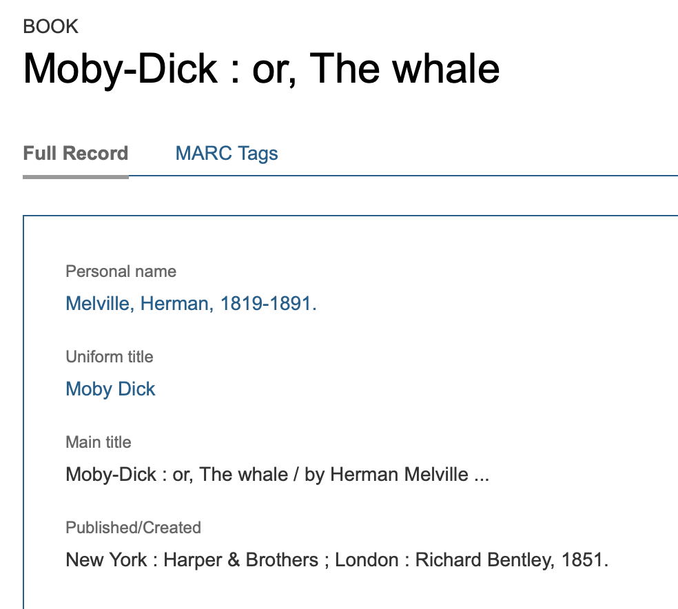
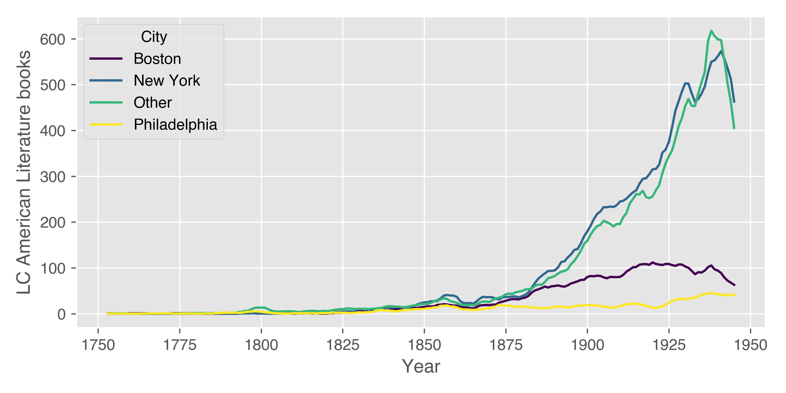

# Introduction

Literary historians of the United States broadly agree that, at some point during the nineteenth century, New York City overtakes Boston as the literary capital of the US. What Pascale Casanova argues Paris is for world literature, New York becomes for US literature specifically, and, eventually, Anglophone literatures more generally.[@casanovaWorldRepublicLetters2004] Data recently released by the Library of Congress (LC) allows us to assess this historical claim in new ways, but not in the format in which it was originally released. By converting this data to a useful format for computational literary studies, I have evaluated this claim, and made it possible for ther scholars of nineteenth century US literatures to make use of the same for a wide range of purposes. Perhaps more importantly, the code used to extract the data required to answer this nineteenth century question could be used to extract any fields of interest from any set of the 11 million book catalog records that the LC has made public.

Nancy Glazener has argued that the *Atlantic* magazine "had greater authority over American literature than any other institution did" in the latter half of the nineteenth century.[@glazenerReadingRealismHistory1997, 5] Because of this, the shifting center of US literary culture from Boston to New York City is sometimes personified in *Atlantic* editor William Dean Howells's move from Boston to New York in the 1880s.^[See, e.g., @bentleyLiteraryFormsMass2005a, 250. This symbolically important move cannot be pinned to a single year since, between 1886 and 1891, Howells moves back and forth between Boston and New York several times. @goodmanWilliamDeanHowells2005, xxiv, 279.] Yet the material infrastructures of literary culture involved in such a shift---the means of production, distribution, and, of course, the skilled workers of print culture---could not possibly move as easily as did Howells's prestige from the Charles to the Hudson. While *The History of the Book in America* has already covered many details of these processes, it does not cover the changing imprint geographies of US publishing in general and US literary publishing in particular, in part because this data was not yet available.[@casperIndustrialBook184018802007; @kaestlePrintMotionExpansion2009]

## LC MDS books data

For the first time in 2015 and most recently in 2020, the Library of Congress (LC) released its MARC Distribution Services (MDS) books dataset to the public, which contains more than 11 million book records.^[@BooksAllMDSConnect2020. Thanks to Jaime Mears specifically and LC Labs generally for informing me about this dataset, as well as directing me to past work using this data by Matt Miller and Jer Thorp.] Although these records cannot be said to list every relevant book, it nevertheless remains the largest such catalog to which there is public access.^[OCLC's WorldCat might be more comprehensive, but access is limited.]

[Figure 1](https://lccn.loc.gov/07017953) shows how one very famous record appears on the web.



And here is some of the XML that creates that view of the record:

```xml
<datafield ind1="1" ind2="0" tag="245">
    <subfield code="a">Moby-Dick :</subfield>
    <subfield code="b">or, The whale /</subfield>
    <subfield code="c">by Herman Melville ...</subfield>
  </datafield>
  <datafield ind1=" " ind2=" " tag="260">
    <subfield code="a">New York :</subfield>
    <subfield code="b">Harper &amp; Brothers ;</subfield>
    <subfield code="a">London :</subfield>
    <subfield code="b">Richard Bentley,</subfield>
    <subfield code="c">1851.</subfield>
  </datafield>
```

All of these records were created by librarians. My contribution is extracting, cleaning, and analyzing the data that librarians created in a way that is 1) immediately useful for nineteenth century US literary history, and 2) provides a working model for those in any other field who wish to work with LC MARC records and record fields of their choosing.

## Measuring imprint geographies

Americanists will perhaps be excessively familiar with the "PS" subclass of the LC's Language and Literature classification ("P"), which I use to study the changing imprint geographies of US literature over the long nineteenth century.[@LibraryCongressClassification2024] Generally, I check every classification value of every record to see if any of its classifications are part of the "PS" subclass. I then extract selected fields from the relevant records. Finally, I apply two cleaning steps to the year and place of publication to make them computationally tractable. Readers interested in the details should consult [the repository](https://github.com/erikfredner/c19dc), which includes code to reproduce this locally, and which can be freely modified to extract records and fields in which you are interested.

Given the received narrative from US literary history, I expected to see New York's publishing dominance rise consistently over the century, reaching a more or less unchallenged position after Reconstruction begins in 1866. But the data only partially support that narrative.



The graph shows the absolute growth in the amount of annual publishing in American literature. Note that this represents cataloged publications, not sales or any other measure of readership beyond cataloging librarians' judgment. It is likely that books printed in New York sold better than books printed in, say, Indianapolis (the eighth most frequent place of publication). However, the absolute growth in publication makes it difficult to see the changing proportions of US imprint geographies:


This suggests that serious contestation among Boston, Philadelphia, and New York to be the publishing capital of US literature is over as early as the 1850s, not the post-Civil War period as is often assumed. Most importantly, it also shows that New York never publishes more than half of US literature. Most of the story is not New York.

Relatedly, the revelation of these charts is the size of "Other," which represents every place of publication not named in the legend. Up to the 1850s, "Other" was far larger than any single city, and, as Boston and Philadelphia decline, it keeps pace with (and occasionally exceeds) New York. I have more about these trends in my book manuscript.

For now, suffice it to say that this shows how one can use the transformed MDS Connect data to study questions of historical and critical interest for nineteenth century literatures. Other possible applications of the data---republication of titles, the distribution of unique authors, the text content of the titles themselves, the distribution of publishers, etc.---abound within the data published with this essay. And, by building on the code in the repository, anyone interested in other geographies or other periods can extract similar data from any subset of the LC's 11 million public records.

## Works Cited
